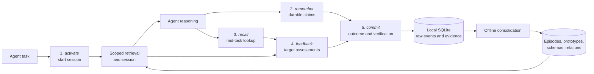

Slowave organizes everything an agent does around a five-verb cognitive cycle: activate, remember, recall, feedback, commit. Each verb maps to a single MCP tool. Together they form a closed loop — the agent opens a task, works with retrieved context, records new durable facts, assesses what it got back, and closes the task with a verified outcome. Background consolidation then turns that raw session activity into longer-lived memory structures, all without calling an LLM.

This page explains what each verb does, how the memory structures behind them work, and what makes the system improve over time.

## The five-verb MCP lifecycle

The diagram below shows the full lifecycle from agent task to durable memory:

The agent remains the reasoning layer throughout. Slowave returns memory and evidence; it never independently decides what the final answer or action should be.

### The five verbs at a glance

| Verb | MCP tool | Purpose | Key constraint |
| --- | --- | --- | --- |
| **activate** | `slowave_activate` | Open a task session and prime working memory with scoped memories and relevant procedures. | `task`, `initial_goal`, and `scope` are all required. |
| **remember** | `slowave_remember` | Store a durable typed claim — fact, decision, constraint, lesson, and so on. | Must use the active session and matching scope. Not for ephemeral task state. |
| **recall** | `slowave_recall` | Perform a deliberate semantic lookup mid-task when the question changes or activation didn't surface enough. | Session-bound and scope-bound. |
| **feedback** | `slowave_feedback` | Record append-only assessments of retrieved memories and procedures. | Task outcome belongs in `commit`, not here. |
| **commit** | `slowave_commit` | Close the task with its outcome, verification, and an optional reusable procedure. | Complete feedback is required for every exposed retrieval target before `commit` will succeed. |

## What each verb does in detail

### activate

`slowave_activate` is called once at the beginning of every task. It receives the verbatim task description, a concise initial goal, and a scope in `kind:id` form (for example `project:my-api`). Slowave opens an implicit task session and returns:

- A compact set of directly relevant or associated memories for that scope.
- Any relevant execution-backed procedures from past tasks.
- Structured warnings (for example scope fragmentation).
- A `retrieval_id` to pass to `slowave_feedback` later.
- A `session_id` required by `recall` and `commit`.

An optional `continuity_id` can correlate related sessions within a single client conversation. Pass the token the server returns — never invent or reuse one from a different conversation.

On a **cold start** (no memory exists yet for the scope), the response signals this clearly. The agent should read a stable context document, preserve only durable facts that are not already observable, and then continue normally.

### remember

`slowave_remember` stores a durable, standalone claim that should survive beyond the current session. It is the only write path for long-term memory from the agent side. Valid memory types are:

<CardGroup cols={3}>
  <Card title="fact" icon="circle-info">
  </Card>

  <Card title="preference" icon="heart">
  </Card>

  <Card title="decision" icon="check">
  </Card>

  <Card title="constraint" icon="lock">
  </Card>

  <Card title="instruction" icon="list">
  </Card>

  <Card title="lesson" icon="graduation-cap">
  </Card>

  <Card title="warning" icon="triangle-exclamation">
  </Card>

  <Card title="open_question" icon="circle-question">
  </Card>

  <Card title="task" icon="clipboard">
  </Card>

  <Card title="artifact" icon="box-archive">
  </Card>
</CardGroup>

Claims may include an optional `occurred_at` timestamp when they describe a specific past event. Slowave always records the wall-clock time of the MCP call separately, preserving the true ordering of session activity.

<Note>
  `slowave_remember` is only for knowledge that should persist across sessions. Ephemeral task state — intermediate results, scratchpad notes, transient observations — belongs in session events, not in long-term memory.
</Note>

### recall

`slowave_recall` is a mid-task semantic lookup. Use it when the question changes direction, when activation didn't surface enough context, or when a specific piece of historical context becomes critical. It returns:

- **Direct memories** — semantically matched to the query.
- **Associated memories** — related through prototype and association structure.
- **Procedures** — execution-backed methods that match the current question.
- **Evidence references** — bounded provenance for inspection (pass `evidence="full"` for full content).

`recall` is always session-bound and scope-bound. It returns a `retrieval_id` that must be passed to `slowave_feedback`.

### feedback

`slowave_feedback` records what actually happened after retrieval. It is append-only — assessments cannot be retracted, only added to. Each retrieved memory gets one of three assessments:

- **`used`** — the memory was actively used during the task.
- **`irrelevant`** — the memory was not useful for this task.
- **`stale`** — the memory is outdated. A stale assessment must include a `stale_reason` (`contradicted`, `superseded`, `outdated`, `unsupported`, or `withdrawn`) and a concise explanation. A superseded memory also names the replacement.

Procedure feedback keeps two signals separate: whether the procedure was `used` or `not_used`, and its observed effect (`helped`, `no_effect`, `harmed`, or `unknown`).

Coverage can be `partial` (silence on unassessed targets is not treated as negative evidence) or `complete` (every exposed target has been assessed). `slowave_commit` enforces that required feedback is present before closing the session.

### commit

`slowave_commit` closes the task with:

- A **final goal** — the confirmed objective.
- An **outcome** — `success`, `partial`, or `failure`.
- An **outcome summary** — a standalone description of the actual result.
- A **verification record** — status, summary, and optional evidence references.
- An optional **procedure** — a reusable method with a summary, durable context, ordered steps, and caveats.

Commit triggers offline memory consolidation. If feedback is incomplete for any exposed retrieval target, `commit` returns a retryable `incomplete_feedback` error listing the outstanding targets. Once all feedback is recorded, the commit succeeds and the session closes.

## Local memory components

After a session commits, raw events flow through a consolidation pipeline that produces several types of durable memory structures. No LLM is involved in this path — only local embeddings and deterministic operations.

| Component | Role |
| --- | --- |
| **Raw events and sessions** | The ordered audit record of all tool activity, task outcome, verification, and provenance. |
| **Episodic memory** | Individual experiences with scope, time, salience, and embeddings. Formed from eligible raw events. |
| **Prototypes and associations** | Groups of related episodes that retain local semantic, temporal, and co-occurrence structure. |
| **Schemas** | Durable, searchable memory records with evidence and lifecycle state. The primary retrieval target. |
| **Procedures** | Explicit execution-backed methods captured at commit time: summary, context, ordered steps, and caveats. |
| **Retrieval snapshots and feedback events** | Preserve exactly what was exposed, how it was reached, and what the agent reported. |

SQLite is the source of durable state for all of these. The dashboard and CLI expose every layer for inspection.

## Background consolidation

Between sessions, a background worker consolidates eligible session activity without any LLM calls:

1. Eligible raw events are encoded as **episodic memories** using local embeddings.
2. Related episodes are grouped into **prototypes** and associated through semantic, temporal, and co-occurrence signals.
3. Prototype activity produces and maintains searchable **schema records** — the memory objects your agent retrieves during activation and recall.

Geometry (embedding similarity) can establish topical association, but it is not authoritative for semantic truth. Contradiction and supersession are recorded through explicit agent feedback with evidence, not inferred from embedding distance alone.

## Retrieval and working memory

When `activate` or `recall` runs, Slowave constructs a compact working-memory set by considering:

- **Semantic relevance** — embedding similarity between the current query and stored schemas.
- **Scope eligibility** — only memories within the current scope (or those that have generalized beyond it) are candidates.
- **Temporal context** — recency and source time are ranking signals.
- **Salience** — strengthened by positive feedback, weakened by irrelevant or stale assessments.
- **Bounded associations** — related prototypes can surface associated memories with a `pathway: "associated"` label.

The result is intentionally bounded. Slowave returns a compact working-memory brief, not an ever-growing transcript. The agent decides how to use that brief in its own reasoning.

## Scope generalization

Memory starts scoped to its origin project. Over time, schemas that prove useful across distinct scopes and sessions can earn broader visibility:

| Stage | Visibility |
| --- | --- |
| **Scoped** | Origin scope only. |
| **Portable** | Related scopes of the same kind. |
| **Contextual** | Other scopes, with a retrieval penalty. |
| **Global** | Broad visibility after strong cross-scope evidence. |

This mechanism reduces accidental context leakage during ordinary work. It is not an authorization boundary — use separate memory stores when hard isolation between projects, users, or tenants is required.

## How salience and feedback evolve memory

Feedback is the primary signal that drives memory evolution:

- **Positive feedback** (`used`, procedure `helped`) strengthens the salience of a memory, making it more likely to be returned in future activations.
- **Negative feedback** (`irrelevant`) reduces priority without deleting the memory.
- **Stale feedback** marks a memory's lifecycle state. Stale or superseded memories stop appearing in normal retrieval but their source evidence is preserved for audit.

There is intentionally no agent-facing "forget" tool. Suppressing a memory is a human decision made after inspecting it through the dashboard or CLI. Suppression is reversible and never deletes the underlying evidence.

## Procedures

Procedures are distinct from ordinary remembered claims. They are explicit records captured at commit time:

- A **summary** and **goal** describing what the procedure accomplishes.
- **Durable context** — facts about the environment the procedure was developed in.
- **Ordered steps** — the concrete actions taken.
- **Caveats** — known limitations, failure conditions, or warnings.
- **Evidence** — accumulated feedback from every time the procedure has been attempted.

When a future activation or recall matches the goal of a stored procedure, Slowave surfaces it as a candidate. Later feedback records its observed usefulness. Failed procedures remain available as cautionary evidence when relevant.

<Tip>
  Procedures explain; they never prescribe. Slowave supplies context about what has tended to work — the agent remains the decision-maker about what to actually do.
</Tip>

## Operational boundaries

<CardGroup cols={2}>
  <Card title="Memory layer only" icon="layer-group">
    Slowave supplies context. The connected agent is responsible for reasoning, planning, answer construction, and tool execution.
  </Card>

  <Card title="Cannot recall what was never recorded" icon="ban">
    Memory quality depends on the agent writing clear, durable claims. Slowave cannot surface knowledge that was never explicitly remembered.
  </Card>

  <Card title="Token overhead" icon="coins">
    Tool calls and retrieved context add tokens to each task. The compact working-memory brief limits this, but it is not zero.
  </Card>

  <Card title="Plaintext by default" icon="shield">
    The local SQLite database is not encrypted by default. Protect it with OS permissions or full-disk encryption for sensitive projects.
  </Card>
</CardGroup>

For the full MCP tool contracts — parameter shapes, return types, error codes, and feedback requirements — see the [MCP overview](/mcp/overview).
