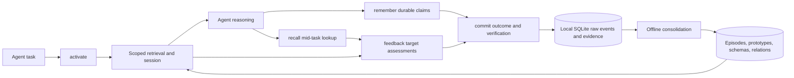

Slowave keeps durable memory in a local SQLite database. An MCP client opens a task session, retrieves relevant memory, records durable claims when needed, assesses retrieved evidence, and closes the task with an outcome. Background consolidation then turns eligible session activity into longer-lived memory structures — episodic memories, prototypes, schemas, and relations — without ever calling an LLM. The agent remains the reasoning layer throughout. Slowave returns memory and evidence; it does not independently decide what the final answer or action should be.

## Overview

The diagram below shows the full path from an agent task through the five public verbs to offline consolidation and back into retrieval.

## The public cognitive cycle

The MCP interface intentionally exposes five task-level verbs. Together they form a complete cognitive loop: prime, record, look up, assess, and close.

| Verb | Purpose | Important constraint |
| --- | --- | --- |
| `slowave_activate` | Starts a task session and primes working memory with scoped memories and relevant procedures. | `task`, `initial_goal`, and `scope` are required. |
| `slowave_remember` | Stores a durable typed claim. | Must use the active session and matching scope. |
| `slowave_recall` | Performs a deliberate semantic lookup during the same task. | Session-bound and scope-bound. |
| `slowave_feedback` | Records target-specific assessments of retrieved memories and procedures. | Task outcome belongs in commit, not feedback. |
| `slowave_commit` | Closes the task with its outcome, verification, and, when applicable, a procedure. | Complete feedback is required for every exposed retrieval target. |

Activation returns an opaque continuity ID. A client omits it for a new conversation and reuses the returned value unchanged for later tasks in that same conversation. Continuity correlates related sessions; it does not relax the scope boundary.

### Activate

Activation receives the verbatim task, a concise initial goal, and a scope. It opens an implicit task session and returns a compact set of directly relevant or associated memories, relevant execution-backed procedures, warnings, and a retrieval ID for later feedback.

On a cold start, the response signals that no memory exists yet for the scope. The client should read one stable context document, preserve only durable facts that are not already observable, and then continue normally.

### Remember

Remember is for durable, standalone claims such as facts, preferences, decisions, constraints, lessons, warnings, and durable tasks. It deliberately does not store transient work state or a narration of the current task.

Claims may include `occurred_at` when they describe a specific past event. Slowave separately records the time it received the call, preserving the real ordering of session activity.

<Note>
  The valid memory types are: `fact`, `preference`, `decision`, `constraint`, `instruction`, `lesson`, `warning`, `open_question`, `task`, and `artifact`. Both a single claim and a batch `memories` list are accepted; the two forms are mutually exclusive.
</Note>

### Recall

Recall is a mid-task lookup when the question changes or activation did not surface enough context. It returns canonical memories and procedures plus bounded provenance references. Full evidence mode adds bounded source content for inspection.

### Feedback

Feedback records what actually happened after retrieval. A memory assessment is `used`, `irrelevant`, or `stale`. Stale feedback must name its reason; a superseded memory also names the active replacement. Procedure feedback records both whether the procedure was used and whether it helped, had no effect, caused harm, or remains unknown.

Feedback is append-only. A `complete` coverage declaration assesses every target exposed by that retrieval; a `partial` declaration leaves unassessed targets unknown rather than treating silence as negative evidence.

### Commit

Commit stores the final goal, honest outcome, and structured verification. When the work produced a clear reusable method, it can also capture a procedure with context, steps, and caveats. The commit preflight rejects closure with a retryable error until required retrieval feedback is complete.

<Warning>
  If commit is skipped, an idle-session reaper closes the session after `SLOWAVE_SESSION_IDLE_TIMEOUT` seconds (default 3600). Always call commit at the end of a task for clean memory consolidation.
</Warning>

---

## Local memory components

All durable state lives in a local SQLite database. The dashboard and CLI expose this state for inspection; they do not rely on a hosted control plane.

| Component | Role |
| --- | --- |
| Raw events and sessions | Preserve the ordered record of tool activity, task outcome, verification, and provenance. |
| Episodic memory | Represents eligible individual experiences with scope, time, salience, and embeddings. |
| Prototypes and associations | Group related episodes and retain local semantic, temporal, and co-occurrence structure. |
| Schemas | Provide durable, searchable memory records with evidence and lifecycle state. |
| Procedures | Store execution-backed methods captured when a task closes. |
| Retrieval snapshots and feedback events | Preserve what was exposed, how it was reached, and what the client later reported. |

---

## From activity to durable memory

Session activity is first recorded as raw events. Eligible events are encoded as episodes. Offline consolidation groups related episodes into prototypes and maintains associations, salience, and searchable schema records.

The system uses local embeddings and deterministic operations throughout this path. It does not ask an LLM to summarize or rewrite memory. A readable memory record is kept at the boundary so agents and people can inspect what the system returned.

<Note>
  Geometry can establish topical association, but it is not authoritative for semantic truth. Contradiction and supersession are recorded through explicit client feedback with evidence, not inferred solely from embedding similarity.
</Note>

---

## Retrieval and working memory

Retrieval begins with the current task or recall query. It considers semantic relevance, scope eligibility, temporal context, salience, and bounded associations. Direct matches and associated results are distinguished in the returned data.

The result is intentionally bounded: Slowave returns a compact working-memory set rather than an ever-growing transcript. The client chooses whether and how to use that set in its own prompt and reasoning process.

### Scopes and generalization

Ordinary MCP retrieval uses strict scope matching. Scopes use a `kind:id` form — for example `project:my-app` or `client:acme`. Some schemas can earn a broader generalization stage after use across distinct scopes and sessions:

| Stage | Visibility |
| --- | --- |
| Scoped | Origin scope only. |
| Portable | Related scopes of the same kind. |
| Contextual | Other scopes with a retrieval penalty. |
| Global | Broad visibility after strong cross-scope evidence. |

<Warning>
  This mechanism reduces accidental context leakage during ordinary work, but it is not an authorization system. Separate sensitive projects, users, or tenants into separate stores when hard isolation is required.
</Warning>

### Time

Each stored experience has a recording time and can retain an optional source time for an earlier real-world event. Temporal context is a ranking signal, not a promise of exact natural-language date interpretation. The client can inspect source evidence when date provenance matters.

---

## Memory lifecycle states and human control

Active memory normally participates in retrieval. Feedback can mark memory stale or record a superseding replacement, while deduplication can archive an exact duplicate. A person can suppress a memory through the CLI or dashboard; suppression is reversible and does not delete its source evidence.

<Note>
  There is intentionally no agent-facing MCP forget tool. Forgetting is a human decision made after inspecting a specific memory, not an inference from conversation text.
</Note>

---

## Procedures

Procedures are separate from ordinary remembered claims. They are explicit records captured at commit time, including a summary, durable context, ordered steps, and caveats. Retrieval may surface a procedure that matches the current task; later feedback records its observed usefulness.

A procedure is evidence from past work, not an instruction that the agent must follow. Failed attempts remain available as warnings when relevant.

<Accordion title="Procedure fields at commit time">
  When capturing a procedure through `slowave_commit`, the `procedure` object can include:

  - **goal** — what the procedure is intended to accomplish
  - **summary** — a short human-readable description
  - **context** — durable facts that condition when the procedure applies
  - **steps** — ordered list of actions
  - **caveats** — known limitations, failure modes, or conditions that invalidate the procedure
</Accordion>

---

## Operational boundaries

<Warning>
  Slowave is public beta software. Its APIs, configuration, and storage schema may change; migrations are not guaranteed before stable release. The local database is plaintext by default and should be protected accordingly.
</Warning>

The architecture is inspired by episodic memory, consolidation, and associative recall. These are design analogies, not claims that Slowave is a biological simulation or that the analogy establishes retrieval quality.

Slowave keeps durable memory in a local SQLite database. An MCP client opens a task session, retrieves relevant memory, records durable claims when needed, assesses retrieved evidence, and closes the task with an outcome. Background consolidation then turns eligible session activity into longer-lived memory structures — episodic memories, prototypes, schemas, and relations — without ever calling an LLM. The agent remains the reasoning layer throughout. Slowave returns memory and evidence; it does not independently decide what the final answer or action should be.

## Overview

The diagram below shows the full path from an agent task through the five public verbs to offline consolidation and back into retrieval.

## The public cognitive cycle

The MCP interface intentionally exposes five task-level verbs. Together they form a complete cognitive loop: prime, record, look up, assess, and close.

| Verb | Purpose | Important constraint |
| --- | --- | --- |
| `slowave_activate` | Starts a task session and primes working memory with scoped memories and relevant procedures. | `task`, `initial_goal`, and `scope` are required. |
| `slowave_remember` | Stores a durable typed claim. | Must use the active session and matching scope. |
| `slowave_recall` | Performs a deliberate semantic lookup during the same task. | Session-bound and scope-bound. |
| `slowave_feedback` | Records target-specific assessments of retrieved memories and procedures. | Task outcome belongs in commit, not feedback. |
| `slowave_commit` | Closes the task with its outcome, verification, and, when applicable, a procedure. | Complete feedback is required for every exposed retrieval target. |

Activation returns an opaque continuity ID. A client omits it for a new conversation and reuses the returned value unchanged for later tasks in that same conversation. Continuity correlates related sessions; it does not relax the scope boundary.

### Activate

Activation receives the verbatim task, a concise initial goal, and a scope. It opens an implicit task session and returns a compact set of directly relevant or associated memories, relevant execution-backed procedures, warnings, and a retrieval ID for later feedback.

On a cold start, the response signals that no memory exists yet for the scope. The client should read one stable context document, preserve only durable facts that are not already observable, and then continue normally.

### Remember

Remember is for durable, standalone claims such as facts, preferences, decisions, constraints, lessons, warnings, and durable tasks. It deliberately does not store transient work state or a narration of the current task.

Claims may include `occurred_at` when they describe a specific past event. Slowave separately records the time it received the call, preserving the real ordering of session activity.

<Note>
  The valid memory types are: `fact`, `preference`, `decision`, `constraint`, `instruction`, `lesson`, `warning`, `open_question`, `task`, and `artifact`. Both a single claim and a batch `memories` list are accepted; the two forms are mutually exclusive.
</Note>

### Recall

Recall is a mid-task lookup when the question changes or activation did not surface enough context. It returns canonical memories and procedures plus bounded provenance references. Full evidence mode adds bounded source content for inspection.

### Feedback

Feedback records what actually happened after retrieval. A memory assessment is `used`, `irrelevant`, or `stale`. Stale feedback must name its reason; a superseded memory also names the active replacement. Procedure feedback records both whether the procedure was used and whether it helped, had no effect, caused harm, or remains unknown.

Feedback is append-only. A `complete` coverage declaration assesses every target exposed by that retrieval; a `partial` declaration leaves unassessed targets unknown rather than treating silence as negative evidence.

### Commit

Commit stores the final goal, honest outcome, and structured verification. When the work produced a clear reusable method, it can also capture a procedure with context, steps, and caveats. The commit preflight rejects closure with a retryable error until required retrieval feedback is complete.

<Warning>
  If commit is skipped, an idle-session reaper closes the session after `SLOWAVE_SESSION_IDLE_TIMEOUT` seconds (default 3600). Always call commit at the end of a task for clean memory consolidation.
</Warning>

---

## Local memory components

All durable state lives in a local SQLite database. The dashboard and CLI expose this state for inspection; they do not rely on a hosted control plane.

| Component | Role |
| --- | --- |
| Raw events and sessions | Preserve the ordered record of tool activity, task outcome, verification, and provenance. |
| Episodic memory | Represents eligible individual experiences with scope, time, salience, and embeddings. |
| Prototypes and associations | Group related episodes and retain local semantic, temporal, and co-occurrence structure. |
| Schemas | Provide durable, searchable memory records with evidence and lifecycle state. |
| Procedures | Store execution-backed methods captured when a task closes. |
| Retrieval snapshots and feedback events | Preserve what was exposed, how it was reached, and what the client later reported. |

---

## From activity to durable memory

Session activity is first recorded as raw events. Eligible events are encoded as episodes. Offline consolidation groups related episodes into prototypes and maintains associations, salience, and searchable schema records.

The system uses local embeddings and deterministic operations throughout this path. It does not ask an LLM to summarize or rewrite memory. A readable memory record is kept at the boundary so agents and people can inspect what the system returned.

<Note>
  Geometry can establish topical association, but it is not authoritative for semantic truth. Contradiction and supersession are recorded through explicit client feedback with evidence, not inferred solely from embedding similarity.
</Note>

---

## Retrieval and working memory

Retrieval begins with the current task or recall query. It considers semantic relevance, scope eligibility, temporal context, salience, and bounded associations. Direct matches and associated results are distinguished in the returned data.

The result is intentionally bounded: Slowave returns a compact working-memory set rather than an ever-growing transcript. The client chooses whether and how to use that set in its own prompt and reasoning process.

### Scopes and generalization

Ordinary MCP retrieval uses strict scope matching. Scopes use a `kind:id` form — for example `project:my-app` or `client:acme`. Some schemas can earn a broader generalization stage after use across distinct scopes and sessions:

| Stage | Visibility |
| --- | --- |
| Scoped | Origin scope only. |
| Portable | Related scopes of the same kind. |
| Contextual | Other scopes with a retrieval penalty. |
| Global | Broad visibility after strong cross-scope evidence. |

<Warning>
  This mechanism reduces accidental context leakage during ordinary work, but it is not an authorization system. Separate sensitive projects, users, or tenants into separate stores when hard isolation is required.
</Warning>

### Time

Each stored experience has a recording time and can retain an optional source time for an earlier real-world event. Temporal context is a ranking signal, not a promise of exact natural-language date interpretation. The client can inspect source evidence when date provenance matters.

---

## Memory lifecycle states and human control

Active memory normally participates in retrieval. Feedback can mark memory stale or record a superseding replacement, while deduplication can archive an exact duplicate. A person can suppress a memory through the CLI or dashboard; suppression is reversible and does not delete its source evidence.

<Note>
  There is intentionally no agent-facing MCP forget tool. Forgetting is a human decision made after inspecting a specific memory, not an inference from conversation text.
</Note>

---

## Procedures

Procedures are separate from ordinary remembered claims. They are explicit records captured at commit time, including a summary, durable context, ordered steps, and caveats. Retrieval may surface a procedure that matches the current task; later feedback records its observed usefulness.

A procedure is evidence from past work, not an instruction that the agent must follow. Failed attempts remain available as warnings when relevant.

<Accordion title="Procedure fields at commit time">
  When capturing a procedure through `slowave_commit`, the `procedure` object can include:

  - **goal** — what the procedure is intended to accomplish
  - **summary** — a short human-readable description
  - **context** — durable facts that condition when the procedure applies
  - **steps** — ordered list of actions
  - **caveats** — known limitations, failure modes, or conditions that invalidate the procedure
</Accordion>

---

## Operational boundaries

<Warning>
  Slowave is public beta software. Its APIs, configuration, and storage schema may change; migrations are not guaranteed before stable release. The local database is plaintext by default and should be protected accordingly.
</Warning>

The architecture is inspired by episodic memory, consolidation, and associative recall. These are design analogies, not claims that Slowave is a biological simulation or that the analogy establishes retrieval quality.
